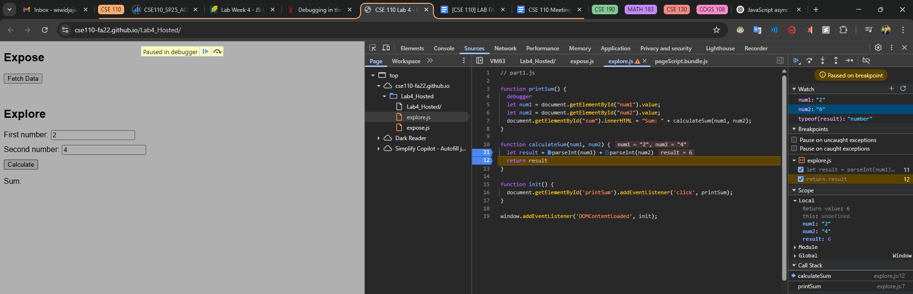

# Explore Part 2

1. The bug is that the numbers are being added together as strings instead of as numbers or integers.

2. I would use the JavaScript `parseInt` function to parse both `num1` and `num2` from strings to numbers.
   
